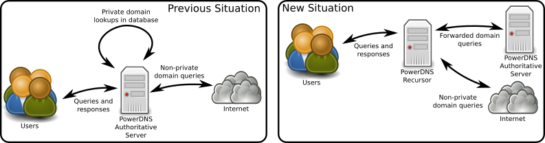
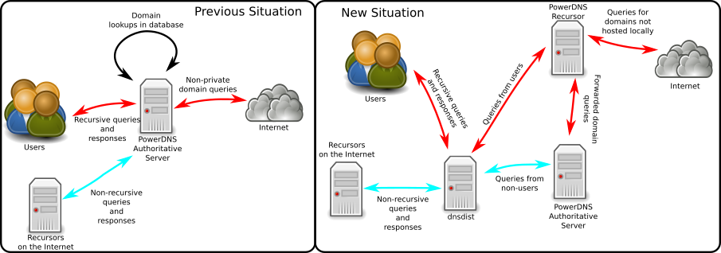

Migrating from using recursion on the Authoritative Server to using a Recursor
==============================================================================

Recursion was removed from the Authoritative Server in version 4.1.0.
This chapter discusses two scenarios and how to migrate to a new set up.

The first scenario is the one where the Authoritative Server is used as
a recursor with some private domains for trusted clients. The second
scenario is the one where the Authoritative Server serves publicly
available domains and is a recursor for a subset of clients.

Scenario 1: Authoritative Server as Recursor with private zones
---------------------------------------------------------------

In this scenario, the Authoritative Server is used as a Recursor for a
set of users and systems. Its database contains several private domains
that are not served on the internet.

This means that migrating means that a Recursor should listen on the
address the Authoritative Server. The Authoritative Server will need to
listen on the local loopback interface and the Recursor should forward
queries to the private domains to the Authoritative Server.

.. note::
  These steps to require restarts and changes where services are
  bound to, it will inevitably lead to some down time. This guide attempts
  to prevent downtime to a minimum.

Migration plan
~~~~~~~~~~~~~~

1. Remove all recursion related settings from ``pdns.conf``
^^^^^^^^^^^^^^^^^^^^^^^^^^^^^^^^^^^^^^^^^^^^^^^^^^^^^^^^^^^

All settings related to recursion need to be commented out or removed
from ``pdns.conf`` and any files included from there. These settings
should be removed:

-  ``allow-recursion``
-  ``recursive-cache-ttl``
-  ``recursor``

2. Change the listen address and port for the Authoritative Server
^^^^^^^^^^^^^^^^^^^^^^^^^^^^^^^^^^^^^^^^^^^^^^^^^^^^^^^^^^^^^^^^^^

To make the authoritative server listen on the local loopback address
and port 5300 change the following in ``pdns.conf``:

.. code-block:: ini

    local-ipv6=
    local-address=127.0.0.1
    local-port=5300

3. Install and configure the PowerDNS Recursor
^^^^^^^^^^^^^^^^^^^^^^^^^^^^^^^^^^^^^^^^^^^^^^

This is most likely an ``apt-get`` or ``yum install`` away, see the
`Recursor documentation <https://doc.powerdns.com/recursor/getting-started.html#installation>`__ for more information.

It might be possible that the Recursor can not start as the listen
address is in use by the Authoritative Server, this is fine for now.

Now configure the listen addresses and ACL for the Recursor to be the
same as the Authoritative Server had. The following settings should be
migrated:

+-------------------------+---------------------+
| Authoritative Setting   | Recursor Setting    |
+=========================+=====================+
| ``local-address``       | ``local-address``   |
+-------------------------+---------------------+
| ``local-ipv6``          | ``local-address``   |
+-------------------------+---------------------+
| ``allow-recursion``     | ``allow-from``      |
+-------------------------+---------------------+
| ``local-port``          | ``local-port``      |
+-------------------------+---------------------+

Now configure the recursor to forward the private domains to the
Authoritative Server. This is done using the
`forward-zones <https://doc.powerdns.com/recursor/settings.html#forward-zones>`__ setting in
``recursor.conf``. The domains should be forwarded to 127.0.0.1:5300
(the new address and port of the Authoritative Server):

.. code-block:: ini

    forward-zones=private.example.com=127.0.0.1:5300
    forward-zones+=another.example.com=127.0.0.1:5300
    # etc..

4. Restart the Authoritative Server and the Recursor
^^^^^^^^^^^^^^^^^^^^^^^^^^^^^^^^^^^^^^^^^^^^^^^^^^^^

Restart the Authoritative Server first so its bind addresses become free
for the recursor.

Scenario 2: Authoritative Server as Recursor for clients and serving public domains
-----------------------------------------------------------------------------------

The best way to "migrate" in this scenario is to separate the recursive
service fully from the Authoritative Server. See `Dan Bernstein's
article <http://cr.yp.to/djbdns/separation.html>`__ on this topic.

If this is not possible, this migration guide will maintain the
functionality of the existing installation while allowing to upgrade.

Migration plan
~~~~~~~~~~~~~~

1. Remove all recursion related settings from ``pdns.conf``
^^^^^^^^^^^^^^^^^^^^^^^^^^^^^^^^^^^^^^^^^^^^^^^^^^^^^^^^^^^

All settings related to recursion need to be commented out or removed
from ``pdns.conf`` and any files included from there. These settings
should be removed:

-  ``allow-recursion``
-  ``recursive-cache-ttl``
-  ``recursor``

2. Change the listen address and port for the Authoritative Server
^^^^^^^^^^^^^^^^^^^^^^^^^^^^^^^^^^^^^^^^^^^^^^^^^^^^^^^^^^^^^^^^^^

To make the authoritative server listen on the local loopback address
and port 5300 change the following in ``pdns.conf``:

.. code-block:: ini

    local-ipv6=
    local-address=127.0.0.1
    local-port=5300

3. Install and configure the PowerDNS Recursor
^^^^^^^^^^^^^^^^^^^^^^^^^^^^^^^^^^^^^^^^^^^^^^

This is most likely an ``apt-get`` or ``yum install`` away, see the
`Recursor's Install Guide <https://doc.powerdns.com/recursor/getting-started.html#installation>`__ for more
information.

It might be possible that the Recursor can not start as the listen
address is in use by the Authoritative Server, this is fine for now.

Configure the recursor to listen on the local loopback interface on a
different port than the Authoritative Server. Set the following in
``recursor.conf``:

.. code-block:: ini

    local-address=127.0.0.1
    local-port=5301

Now configure the recursor to forward the private domains to the
Authoritative Server. This is done using the
`forward-zones <https://doc.powerdns.com/recursor/settings.html#forward-zones>`__ setting in
``recursor.conf``. The domains should be forwarded to 127.0.0.1:5300
(the new address and port of the Authoritative Server):

.. code-block:: ini

    forward-zones=private.example.com=127.0.0.1:5300
    forward-zones+=another.example.com=127.0.0.1:5300
    # etc..

4. Install and configure dnsdist
^^^^^^^^^^^^^^^^^^^^^^^^^^^^^^^^

`dnsdist <https://dnsdist.org>`__ is a DNS loadbalancer from the people
behind PowerDNS that balances DNS packets based on rules. See the
`dnsdist download instructions <https://dnsdist.org/install.html>`__ on how
to install dnsdist.

This guide assumes dnsdist 1.2 or dnsdist master.

After installing, configure dnsdist in ``/etc/dnsdist/dnsdist.conf``.
This is where several settings from the existing Authoritative Server
(like listen address and recursive ACL) will be moved to.

+-------------------------+--------------------------------------+
| Authoritative Setting   | dnsdist Setting                      |
+=========================+======================================+
| ``local-address``       | ``setLocal()`` and ``addLocal()``    |
+-------------------------+--------------------------------------+
| ``local-ipv6``          | ``setLocal()`` and ``addLocal()``    |
+-------------------------+--------------------------------------+
| ``local-port``          | ``setLocal()`` and ``addLocal()``    |
+-------------------------+--------------------------------------+
| ``allow-recursion``     | used in the ``NetmaskGroupRule()``   |
+-------------------------+--------------------------------------+

.. code:: lua

    setLocal('IPADDRESS:PORT')
    addLocal('ANOTHERIPADDRESS:PORT')
    setACL({'0.0.0.0/0', '::/0'}) -- Allow all IPs access

    newServer({address='127.0.0.1:5300', pool='auth'})
    newServer({address='127.0.0.1:5301', pool='recursor'})

    recursive_ips = newNMG()
    recursive_ips:addMask('NETWORKMASK1') -- These network masks are the ones from allow-recursion in the Authoritative Server
    recursive_ips:addMask('NETWORKMASK2')

    addAction(NetmaskGroupRule(recursive_ips), PoolAction('recursor'))
    addAction(AllRule(), PoolAction('auth'))

This configuration will route all queries from the netmasks that are
allowed to do recursion to the Recursor and all other queries to the
Authoritative Server.

5. Restart the Authoritative Server, the Recursor and dnsdist
^^^^^^^^^^^^^^^^^^^^^^^^^^^^^^^^^^^^^^^^^^^^^^^^^^^^^^^^^^^^^

Restart the Authoritative Server first so its bind addresses become free
for the recursor.
