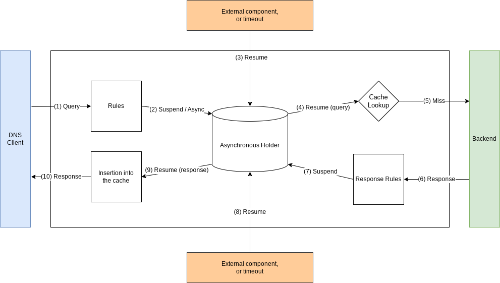

Asynchronous processing
=======================

Since 1.8.0, dnsdist has the ability to process queries and responses in an asynchronous way, suspending them to continue processing other queries and responses, while we are waiting for an external event to occur.

This is done by calling the :meth:`DNSQuestion:suspend` method on a query or a response to pause it, then later the :func:`getAsynchronousObject` to retrieve it before resuming via :meth:`AsynchronousObject:resume`.

A timeout must be supplied when pausing a query or a response, to prevent paused objects from piling up, consuming memory. When the timeout expires, the suspended object is automatically retrieved and resumes its processing where it was left.

The following code shows a very simple example that forwards queries and responses to an external component over a unix network socket, and resumes them when it gets an answer from the external component.

.. code-block:: lua

    local asyncID = 0
    local asyncResponderEndpoint = newNetworkEndpoint('/path/to/unix/network/socket/remote/endpoint')
    local listener = newNetworkListener()
    listener:addUnixListeningEndpoint('/path/to/unix/network/socket/local/endpoint', 0, gotAsyncResponse)
    listener:start()

    function gotAsyncResponse(endpointID, message, from)
      local queryID = tonumber(message)
      local asyncObject = getAsynchronousObject(asyncID, queryID)
      local dq = asyncObject:getDQ()
      dq:setTag(filteringTagName, filteringTagValue)
      asyncObject:resume()
    end

    function passQueryToAsyncFilter(dq)
      local timeout = 500 -- 500 ms
      local buffer = dq:getContent()
      local id = dq.dh:getID()
      dq:suspend(asyncID, id, timeout)
      asyncResponderEndpoint:send(buffer)
      return DNSAction.Allow
    end

  function passResponseToAsyncFilter(dr)
      local timeout = 500 -- 500 ms
      local buffer = dr:getContent()
      local id = dr.dh:getID()
      dr:suspend(asyncID, id, timeout)
      asyncResponderEndpoint:send(buffer)
      return DNSResponseAction.Allow
    end

    addAction(AllRule(), LuaAction(passQueryToAsyncFilter))
    addCacheHitResponseAction(AllRule(), LuaResponseAction(passResponseToAsyncFilter))
    addResponseAction(AllRule(), LuaResponseAction(passResponseToAsyncFilter))
