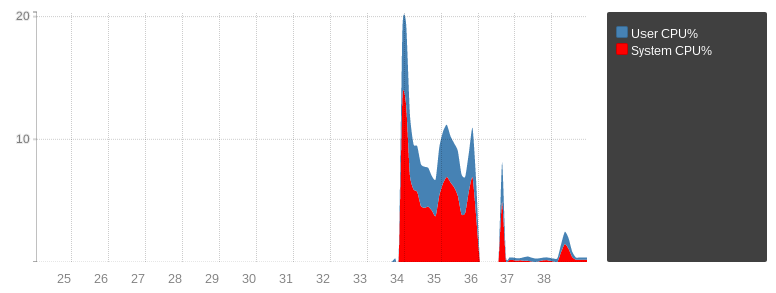

eBPF Socket Filtering
=====================

:program:`dnsdist` can use `eBPF <https://www.brendangregg.com/ebpf.html>`_ socket filtering on recent Linux kernels (4.1+) built with eBPF support (``CONFIG_BPF``, ``CONFIG_BPF_SYSCALL``, ideally ``CONFIG_BPF_JIT``). It requires dnsdist to have the ``CAP_SYS_ADMIN`` capabilities at startup.

.. note::
   To retain the required capability, ``CAP_SYS_ADMIN``, it is necessary to call :func:`addCapabilitiesToRetain` during startup, as :program:`dnsdist` drops capabilities after startup.

.. note::
   eBPF can be used by unprivileged users lacking the ``CAP_SYS_ADMIN`` capability on some kernels, depending on the value of the ``kernel.unprivileged_bpf_disabled`` sysctl. Since 5.15 that kernel build setting ``BPF_UNPRIV_DEFAULT_OFF`` is enabled by default, which prevents unprivileged users from using eBPF.

.. note::
   ``AppArmor`` users might need to update their policy to allow dnsdist to keep the ``CAP_SYS_ADMIN`` capability. Adding a ``capability sys_admin,`` line to the policy file is usually enough.

.. note::
   In addition to keeping the correct capability, large maps might require an increase of ``RLIMIT_MEMLOCK``, as mentioned below.

.. warning::
   As of 1.9.7, eBPF filtering is not supported for QUIC-based protocols, including DNS over QUIC and DNS over HTTP/3.

This feature allows dnsdist to ask the kernel to discard incoming packets in kernel-space instead of them being copied to userspace just to be dropped, thus being a lot of faster. The current implementation supports dropping UDP and TCP queries based on the source IP and UDP datagrams on exact DNS names. We have not been able to implement suffix matching yet, due to a limit on the maximum number of EBPF instructions.

The following figure show the CPU usage of dropping around 20k qps of traffic, first in userspace (34 to 36) then in kernel space with eBPF (37 to 39). The spikes are caused because the drops are triggered by dynamic rules, so the first spike is the abuse traffic before a rule is automatically inserted, and the second spike is because the rule expires automatically after 60s before being inserted again.

The BPF filter can be used to block incoming queries manually::

  > bpf = newBPFFilter({ipv4MaxItems=1024, ipv6MaxItems=1024, qnamesMaxItems=1024})
  > bpf:attachToAllBinds()
  > bpf:block(newCA("2001:DB8::42"))
  > bpf:blockQName(newDNSName("evildomain.com"), 65535)
  > bpf:getStats()
  [2001:DB8::42]: 0
  evildomain.com. 65535: 0
  > bpf:unblock(newCA("2001:DB8::42"))
  > bpf:unblockQName(newDNSName("evildomain.com"), 65535)
  > bpf:getStats()

.. note::
    Before 2.0.0 the value used to block queries for all types was 255. This was changed because it prevented blocking only queries for the ``ANY`` (255) qtype.

The :meth:`BPFFilter:blockQName` method can be used to block queries based on the exact qname supplied, in a case-insensitive way, and an optional qtype.
Using the ``65535`` value for the qtype will block all queries for the qname, regardless of the qtype.

Contrary to source address filtering, qname filtering only works over UDP. TCP qname filtering can be done the usual way::

  addAction(AndRule({TCPRule(true), QNameSuffixRule("evildomain.com")}), DropAction())

The :meth:`BPFFilter:attachToAllBinds` method attaches the filter to every existing bind at runtime. It cannot use at configuration time. The :func:`setDefaultBPFFilter()` should be used at configuration time.

The :meth:`BPFFilter:attachToAllBinds` automatically attached to every bind::

  bpf = newBPFFilter({ipv4MaxItems=1024, ipv6MaxItems=1024, qnamesMaxItems=1024})
  setDefaultBPFFilter(bpf)

Finally, it's also possible to attach it to specific binds at runtime::

  > bpf = newBPFFilter({ipv4MaxItems=1024, ipv6MaxItems=1024, qnamesMaxItems=1024})
  > showBinds()
  #   Address              Protocol  Queries
  0   [::]:53              UDP       0
  1   [::]:53              TCP       0
  > bd = getBind(0)
  > bd:attachFilter(bpf)

:program:`dnsdist` also supports adding dynamic, expiring blocks to a BPF filter:

.. code-block:: lua

  bpf = newBPFFilter({ipv4MaxItems=1024, ipv6MaxItems=1024, qnamesMaxItems=1024})
  setDefaultBPFFilter(bpf)
  local dbr = dynBlockRulesGroup()
  dbr:setQueryRate(20, 10, "Exceeded query rate", 60)

  function maintenance()
    dbr:apply()
  end

This will dynamically block all hosts that exceeded 20 queries/s as measured over the past 10 seconds, and the dynamic block will last for 60 seconds.

Since 1.6.0, the default BPF filter set via :func:`setDefaultBPFFilter` will automatically get used when a "drop" dynamic block is inserted via a :ref:`DynBlockRulesGroup`, which provides a better way to combine dynamic blocks with eBPF filtering.
Before that, it was possible to use the :func:`addBPFFilterDynBlocks` method instead:

.. code-block:: lua

  -- this is a legacy method, please see above for DNSdist >= 1.6.0
  bpf = newBPFFilter({ipv4MaxItems=1024, ipv6MaxItems=1024, qnamesMaxItems=1024})
  setDefaultBPFFilter(bpf)
  dbpf = newDynBPFFilter(bpf)
  function maintenance()
          addBPFFilterDynBlocks(exceedQRate(20, 10), dbpf, 60)
          dbpf:purgeExpired()
  end

The dynamic eBPF blocks and the number of queries they blocked can be seen in the web interface and retrieved from the API. Note however that eBPF dynamic objects need to be registered before they appear in the web interface or the API, using the :func:`registerDynBPFFilter` function::

  registerDynBPFFilter(dbpf)

They can be unregistered at a later point using the :func:`unregisterDynBPFFilter` function.
Since 1.8.2, the metrics for the BPF filter registered via :func:`setDefaultBPFFilter` are exported as well.

Requirements
------------

In addition to the capabilities explained above, that feature might require an increase of the memory limit associated to a socket, via the sysctl setting ``net.core.optmem_max``.
When attaching an eBPF program to a socket, the size of the program is checked against this limit, and the default value might not be enough.

Large map sizes might also require an increase of ``RLIMIT_MEMLOCK``, which can be done by adding ``LimitMEMLOCK=limit`` in the systemd unit file, where limit is specified using byte as unit. It can also be done manually for testing purposes, in a non-permanent way, by using ``ulimit -l``.

To change the default hard limit on ``RLIMIT_MEMLOCK`` add the following line to ``/etc/security/limits.conf`` for the user, specifying a limit in units of 1k, for example:
  > $USER   hard    memlock   1024

External program, maps and XDP filtering
----------------------------------------

Since 1.7.0 dnsdist has the ability to expose its eBPF map to external programs. That feature makes it possible to populate the client IP addresses and qnames maps from dnsdist, usually using the dynamic block mechanism, and to act on the content of these maps from an external program, including a XDP one.
For example, to instruct dnsdist to create under the ``/sys/fs/bpf`` mount point of type ``bpf`` three maps of maximum 1024 entries each, respectively pinned to ``/sys/fs/bpf/dnsdist/addr-v4``, ``/sys/fs/bpf/dnsdist/addr-v6``, ``/sys/fs/bpf/dnsdist/qnames`` for IPv4 addresses, IPv6 ones, and qnames:

.. code-block:: lua

  bpf = newBPFFilter({maxItems=1024, pinnedPath='/sys/fs/bpf/dnsdist/addr-v4'}, {maxItems=1024, pinnedPath='/sys/fs/bpf/dnsdist/addr-v6'}, {maxItems=1024, pinnedPath='/sys/fs/bpf/dnsdist/qnames'}, true)

.. note::
   By default only root can write into a bpf mount point, but it is possible to create a ``dnsdist/`` sub-directory with ``mkdir`` and to make it owned by the ``dnsdist`` user with ``chown``.

The last parameter to :func:`newBPFFilter` is set to ``true`` to indicate to dnsdist not to load its internal eBPF socket filter program, which is not needed since packets will be intercepted by an external program and would at best duplicate the work done by the other program. It also tell dnsdist to use a slightly different format for the eBPF maps:

 * IPv4 and IPv6 maps still use the address as key, but the value contains an action field in addition to the 'matched' counter, to allow for more actions than just dropping the packet
 * the qname map now uses the qname and qtype as key, instead of using only the qname, and the value contains the action and counter fields described above instead of having a counter and the qtype

The first, legacy format is still used because of the limitations of eBPF socket filter programs on older kernels, and the number of instructions in particular, that prevented us from using the qname and qtype as key. We will likely switch to the newer format by default once Linux distributions stop shipping these older kernels. XDP programs require newer kernel versions anyway and have thus fewer limitations.

XDP programs are more powerful than eBPF socket filtering ones as they are not limited to accepting or denying a packet, but can immediately craft and send an answer. They are also executed a bit earlier in the kernel networking path so can provide better performance.

A sample program using the maps populated by dnsdist in an external XDP program can be found in the `contrib/ directory of our git repository <https://github.com/PowerDNS/pdns/tree/master/contrib>`__. That program supports answering with a TC=1 response instead of simply dropping the packet.
