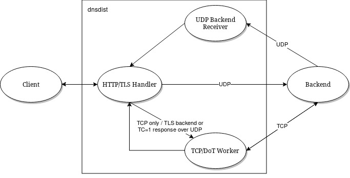

Internal Design
===============

This part of the documentation is intended for developers interested in understanding how the actual code works, and might not be of much interest to regular users.

UDP design
----------

.. figure:: ../imgs/DNSDistUDP.png
   :align: center
   :alt: DNSDist UDP design

For UDP queries, dnsdist stores the initial ID in a per-backend table called *IDState*. That ID then replaced by one derived from a counter before forwarding the query to the backend, to prevent duplicated IDs sent clients from making it to the backend.
When the response is received, dnsdist uses the ID sent by the backend to find the corresponding *IDState* and restores the initial ID, as well as some flags if needed, before sending the response to the client.

That design means that there is a maximum of 65535 in-flight UDP queries per backend. It can actually be even less than that if :func:`setMaxUDPOutstanding` is set to a lower value, for example to reduce the overall memory usage.

Note that the source address and port used to contact a given backend is set at startup, for performance reasons, and then only changes on reconnect. There might be more than one socket, and thus several ports, if the ``sockets`` parameter was set to a higher value than 1 on the :func:`newServer` directive.

Note that, since 1.7, UDP queries can be passed to the backend over TCP if the backend is TCP-only, or configured for DNS over TLS. This is done by passing the incoming query to a TCP worker over a pipe, as was already done for incoming TCP queries.

.. figure:: ../imgs/DNSDistUDPDoT.png
   :align: center
   :alt: DNSDist UDP design for TCP-only, DoT backends

In that case the response will be sent back, directly by the TCP worker, over UDP, instead of being passed back to the UDP responder thread.

TCP / DoT design
----------------

.. figure:: ../imgs/DNSDistTCP.png
   :align: center
   :alt: DNSDist TCP and DoT design

For TCP and DoT, a single thread is created for each :func:`addLocal` and :func:`addTLSLocal` directive, listening to the incoming TCP sockets, accepting new connections and distributing them over a pipe to the TCP worker threads. These threads handle both the TCP connection with the client and the one with the backend.

DNS over HTTP/2 design
----------------------

h2o (up to 1.7)
^^^^^^^^^^^^^^^

.. figure:: ../imgs/DNSDistDoH.png
   :align: center
   :alt: DNSDist DoH design before 1.7

For DNS over HTTP/2, two threads are created for each :func:`addDOHLocal` directive, one handling the TLS and HTTP layers, then passing the queries to the second one over a pipe. The second thread does DNS processing, applying rules and forwarding the query to the backend if needed, over UDP.
Note that even if the query does not need to be passed to a backend (cache-hit, self-generated answer), the response will be passed back to the first thread via a pipe, since only that thread deals with the client.
If the response comes from a backend, it will be picked up by the regular UDP listener for that backend, the corresponding *IDState* object located, and the response sent to the first thread over a pipe.

h2o (1.7 - 1.9)
^^^^^^^^^^^^^^^

Since 1.7, if the UDP response coming from the backend has been truncated (TC bit is set), dnsdist will retry over TCP by passing the query to a TCP worker over a pipe, as was already done for incoming TCP queries. The response will then be passed back to the DoH worker thread over the same pipe that for UDP queries. That also happens if the backend is marked TCP-only, or configured for DNS over TLS, in which case the query is obviously not sent over UDP first but immediately sent to a TCP worker thread.

.. figure:: ../imgs/DNSDistDoH17.png
   :align: center
   :alt: DNSDist DoH design since 1.7

nghttp2 (since 1.9)
^^^^^^^^^^^^^^^^^^^

Since 1.9 incoming DNS over HTTP/2 is no longer implemented via the ``h2o`` library but by ``nghttp2`` instead. The design is roughly the same but has been simplified a bit.
As before, if the UDP response coming from the backend has been truncated (TC bit is set), dnsdist will retry over TCP by passing the query to a TCP worker over a pipe, as was already done for incoming TCP queries. The response will then be passed back to the DoH worker thread over the same pipe that for UDP queries. That also happens if the backend is marked TCP-only, or configured for DNS over TLS, in which case the query is obviously not sent over UDP first but immediately sent to a TCP worker thread.

DNS over HTTP/3 design
----------------------

DNS over HTTP/3 is implemented since 1.9.0 via the ``Quiche`` library. In 1.9.x, queries received over DNS over HTTP/3 are forwarded to the backend over TCP (Do53 TCP, DoT or DoH2).

DoQ design
----------

DNS over QUIC is implemented since 1.9.0 via the ``Quiche`` library. In 1.9.x, queries received over DNS over QUIC are forwarded to the backend over TCP (Do53 TCP, DoT or DoH2).

