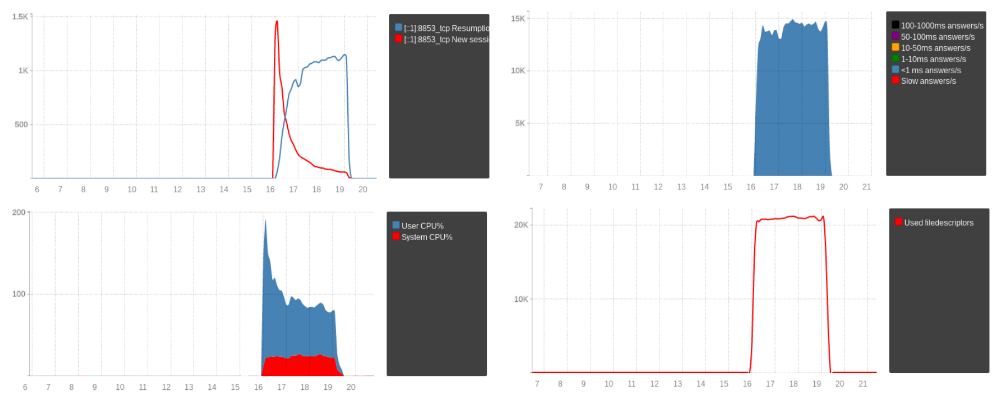

TLS Sessions Management
=======================

TLS sessions
------------

One of the most costly TLS operation is the negotiation of a new session, since both the client and the server need to generate and agree on cryptographic materials. In order to reduce that cost, TLS implements what is called session resumption, where a client opening a new connection to a server can reuse the cryptographic materials negotiated for a previous TLS session.

The following figures show that, with the same number of established incoming connections and queries per second, the ratio of new TLS sessions and resumed sessions has a huge impact on CPU usage:

The necessary information to resume a session can either be kept on the server's side (sessions) or on the client's one (tickets). Initially only the server-side approach existed, with two drawbacks:

- the server needs to keep that information at hand, for a client that might never come back;
- sharing that information between several servers is not easy, especially in setups involving anycast or any kind of cluster without strong session affinity.

Nowadays pretty much all clients support the second option, TLS tickets, where the need information is signed and encrypted by the server before being sent to the client, which is responsible for storing it and sending it back when it wants to establish a new session. That reduces the burden of the server while providing the same benefits.

The server uses Session Ticket Encryption Key (STEK) to sign and encrypt the information sent to the client, making it possible to ensure that it is genuine and has not been tampered when the client provides it later. That STEK can be shared by all dnsdist instances in the same cluster, making it possible for any server to resume a session initially generated by a different server.

Knowing the STEK is all the information needed to be able to decrypt a live TLS session, but also a recorded one, so it is very important to keep that key well-protected. It should never be exchanged in clear-text, and ideally should not be written to persistent storage but be kept in a tmpfs with no swap configured. It should also be regularly rotated to preserve TLS' forward secrecy properties.

Keys management for incoming connections in dnsdist
---------------------------------------------------

dnsdist supports both server's side (sessions) and client's side (tickets) resumption for incoming connections (client to dnsdist).

Since server-side sessions cannot be shared between several instances, and pretty much all clients support tickets anyway, we do recommend disabling the sessions by passing ``numberOfStoredSessions=0`` to the :func:`addDOHLocal` (for DNS over HTTPS) and :func:`addTLSLocal` (for DNS over TLS) functions, or setting ``tls.number_of_stored_sessions=0`` on a :ref:`frontend configuration <yaml-settings-BindConfiguration>` when using YAML.

By default, dnsdist will generate a new, random STEK at startup for each frontend created via :func:`addTLSLocal` and :func:`addDOHLocal` directive, and rotate these STEKs every 12 hours. For each frontend it will keep 5 keys in memory, with only the last one marked as active and used to encrypt new tickets while the remaining ones can still be used to decrypt existing tickets after a rotation. The rotation time and the number of keys to keep in memory can be configured via the ``numberOfTicketsKeys`` and ``ticketsKeysRotationDelay`` parameters of the :func:`addDOHLocal` (for DNS over HTTPS) and :func:`addTLSLocal` (for DNS over TLS) functions.
When the automatic rotation mechanism kicks in a new, random key will be added to the list of keys. With the OpenSSL provider, the new key becomes active, so new tickets will be encrypted with this key, and the existing keys become passive and only be used to decrypt existing tickets. With the GnuTLS provider only one key is currently supported so the existing keys are immediately discarded.
This automatic rotation can be disabled by setting ``ticketsKeysRotationDelay`` to 0.

It is also possible to manually request a STEK rotation using the :func:`getDOHFrontend` (DoH) and :func:`getTLSFrontend` (DoT) functions to retrieve the bind object, and calling its ``rotateTicketsKey`` method (:meth:`DOHFrontend:rotateTicketsKey`, :meth:`TLSFrontend:rotateTicketsKey`).

There is an important difference when the YAML configuration is used: groups of identical frontends can be created via the ``threads`` parameter of a :ref:`frontend configuration <yaml-settings-BindConfiguration>`. Identical frontends then share the same STEKs, even after an automatic or manual rotation. In addition to that, any operation on the STEKs should be done on the first frontend of the group, as attempting to alter the STEKs of the other frontends in a group will be ignored to avoid unwanted side-effects.

The default settings should be fine for most deployments, but generating a random key for every dnsdist instance will not allow resuming the session from a different instance in a cluster. It is also not very useful to have a different key for every :func:`addTLSLocal` and :func:`addDOHLocal` directive if you are using the same certificate and key, and it would be much better to use the same STEK to improve the session resumption ratio.

In that case it is possible to generate the STEK outside of dnsdist, write it to a file, distribute it to all instances using something like rsync over SSH, and load that file from dnsdist. Please remember that the STEK contains very sensitive data, and should be well-protected from access by unauthorized users. It means that special care should be taken to setting the right permissions on that file. Automatic rotation should then be disabled by setting ``ticketsKeysRotationDelay`` to 0.

For the OpenSSL provider (DoT, DoH), generating a random STEK in a file is a simple as getting 80 cryptographically secure random bytes and writing them to a file::

  dd if=/dev/urandom of=/secure-tmp-fs/tickets.key bs=80 count=1

For the GnuTLS provider (DoT), the operation is the same but requires only 64 cryptographically secure random bytes::

  dd if=/dev/urandom of=/secure-tmp-fs/tickets.key bs=64 count=1

The file can then be loaded at startup by using the ``ticketKeyFile`` parameter of the :func:`addDOHLocal` (for DNS over HTTPS) and :func:`addTLSLocal` (for DNS over TLS) functions, or the ``tls.ticket_key_file`` of a :ref:`frontend configuration <yaml-settings-BindConfiguration>` when using YAML.

If the file contains several keys, so for example 240 random bytes, dnsdist will load several STEKs, using the last one for encrypting new tickets and all of them to decrypt existing tickets.

In order to rotate the keys at runtime, it is possible to instruct dnsdist to reload the content of the certificates, keys, and STEKs from the same file used at configuration time, for all DoH and DoH binds, by issuing the :func:`reloadAllCertificates` command.
It can also be done one bind at a time using the :func:`getDOHFrontend` (DoH) and :func:`getTLSFrontend` (DoT) functions to retrieve the bind object, and calling its ``loadTicketsKeys`` method (:meth:`DOHFrontend:loadTicketsKeys`, :meth:`TLSFrontend:loadTicketsKeys`).

One possible way of handling manual rotation of the key would be to first:

- generate ``N`` keys in ``N`` (``1..N``) separate files (for example executing ``dd if=/dev/urandom of=/secure-tmp-fs/N.key bs=80 count=1`` ``N`` times)
- concatenate the ``N`` files into a single file (``/secure-tmp-fs/STEKs.key``) that you pass to dnsdist's ``ticketKeyFile`` parameter

Then, when the STEK should be rotated:

- generate one new key file (``N+1``)
- delete the first key file (``1``)
- concatenate the ``2..N+1`` files into one (``/secure-tmp-fs/STEKs.key``)
- issue :func:`reloadAllCertificates` via the dnsdist console, or call ``loadTicketsKeys('/secure-tmp-fs/STEKs.key')`` for all frontends

This way dnsdist can still decrypt incoming tickets that were encoded via the previous key (the active one is always the one at the end of the file, and we start by removing the one at the beginning of the file).

Content of the STEK file
------------------------

It does not really matter for most operations, but for later reference the format of the OpenSSL STEK is:

- a 16 bytes binary key identifier
- a 32 bytes AES 256 key
- a 32 bytes HMAC SHA-2 256 key

For GnuTLS:

- a 16 bytes binary key identifier
- a 32 bytes AES 256 key
- a 16 bytes HMAC SHA-1 key

Sessions management for outgoing connections
--------------------------------------------

Since 1.7, dnsdist supports securing the connection toward backends using DNS over TLS. For these connections, it keeps a cache of TLS tickets to be able to resume a TLS session quickly. By default that cache contains up to 20 TLS tickets per-backend, is cleaned up every 60s, and TLS tickets expire if they have not been used after 600 seconds.
These values can be set at configuration time via:

 * :func:`setOutgoingTLSSessionsCacheMaxTicketsPerBackend`
 * :func:`setOutgoingTLSSessionsCacheCleanupDelay`
 * :func:`setOutgoingTLSSessionsCacheMaxTicketValidity`
