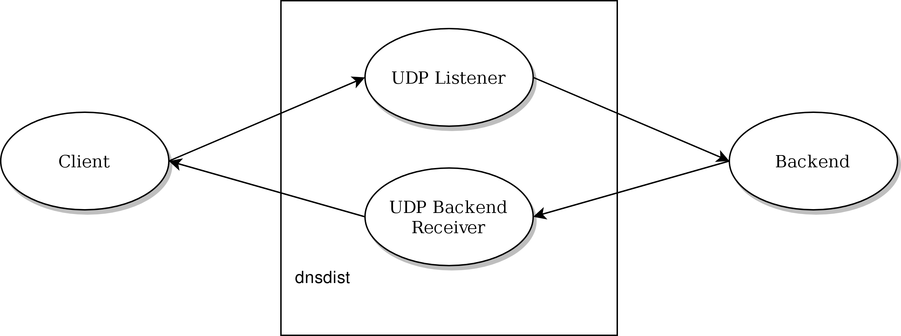
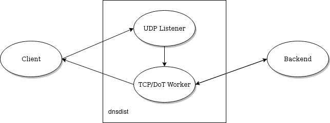
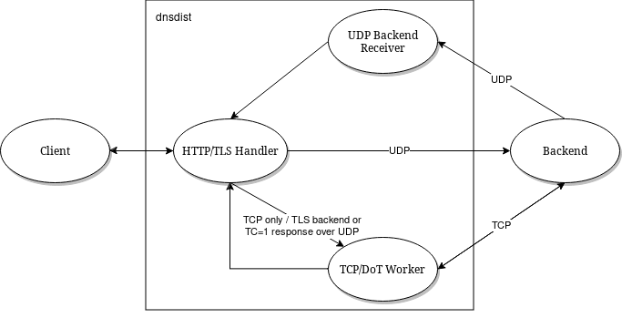
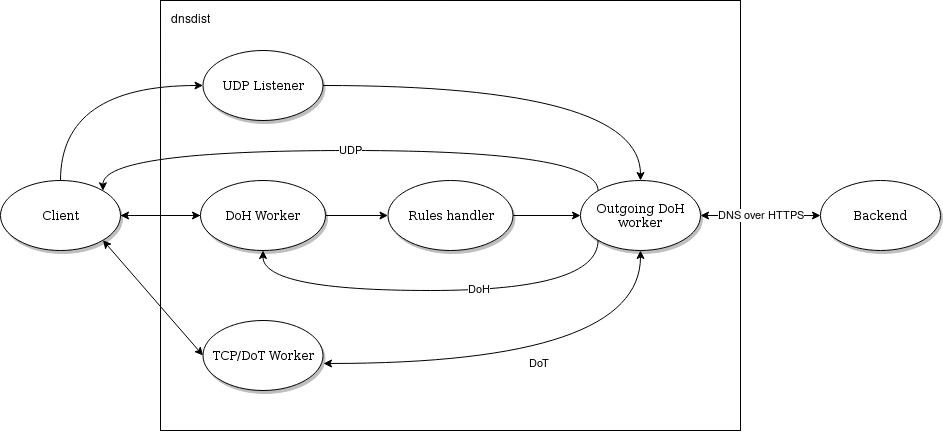
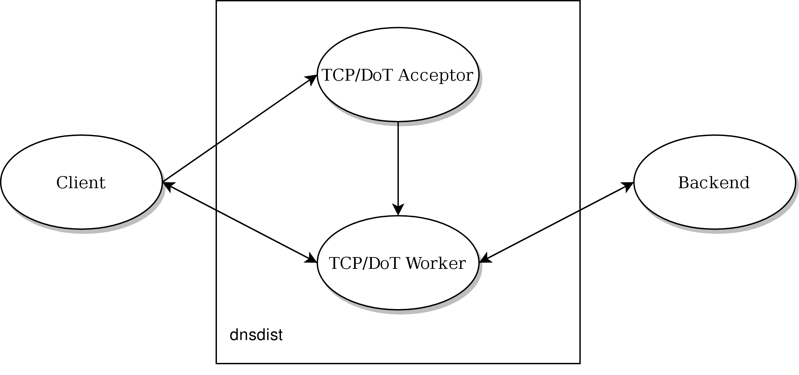
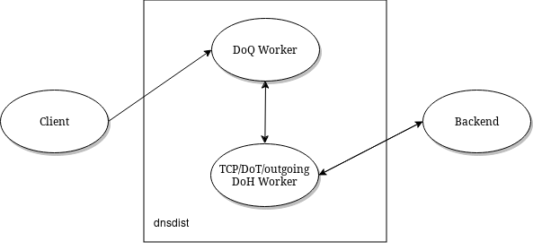

Performance Tuning
==================

First, a few words about :program:`dnsdist` architecture:

 * Each local bind has its own thread listening for incoming UDP queries
 * and its own thread listening for incoming TCP connections, dispatching them right away to a pool of TCP worker threads
 * Each backend has its own thread listening for UDP responses, including the ones triggered by DoH queries, if any
 * A maintenance thread calls the maintenance() Lua function every second if any, and is responsible for cleaning the cache
 * A health check thread checks the backends availability
 * A control thread handles console connections, plus one thread per connection
 * A carbon thread exports statistics to carbon servers if needed
 * One or more webserver threads handle queries to the internal webserver, plus one thread per HTTP connection
 * A SNMP thread handles SNMP operations, when enabled.

UDP and incoming DNS over HTTPS
-------------------------------

:program:`dnsdist` design choices mean that the processing of UDP and DNS over HTTPS queries is done by only one thread per local bind (per :func:`addLocal`, :func:`addDNSCryptLocal` and :func:`addDOHLocal` directive).

This is great to keep lock contention to a low level, but might not be optimal for setups using a lot of processing power, caused for example by a large number of complicated rules.
To be able to use more CPU cores for UDP queries processing, it is possible to use the ``reusePort`` parameter of the :func:`addLocal` and :func:`setLocal` directives to be able to add several identical local binds to dnsdist::

  addLocal("192.0.2.1:53", {reusePort=true})
  addLocal("192.0.2.1:53", {reusePort=true})
  addLocal("192.0.2.1:53", {reusePort=true})
  addLocal("192.0.2.1:53", {reusePort=true})

:program:`dnsdist` will then add four identical local binds as if they were different IPs or ports, start four threads to handle incoming queries and let the kernel load balance those randomly to the threads, thus using four CPU cores for rules processing.
Note that this require ``SO_REUSEPORT`` support in the underlying operating system (added for example in Linux 3.9).
Please also be aware that doing so will increase lock contention and might not therefore scale linearly, as discussed below.

Another possibility is to use the reuseport option to run several dnsdist processes in parallel on the same host, thus avoiding the lock contention issue at the cost of having to deal with the fact that the different processes will not share information, like statistics or DDoS offenders.

The UDP threads handling the responses from the backends do not use a lot of CPU, but if needed it is also possible to add the same backend several times to the dnsdist configuration to distribute the load over several responder threads::

  newServer({address="192.0.2.127:53", name="Backend1"})
  newServer({address="192.0.2.127:53", name="Backend2"})
  newServer({address="192.0.2.127:53", name="Backend3"})
  newServer({address="192.0.2.127:53", name="Backend4"})

When dispatching UDP queries to backend servers, dnsdist keeps track of at most **n** outstanding queries for each backend.
This number **n** can be tuned by the :func:`setMaxUDPOutstanding` directive, defaulting to 65535 which is the maximum value.

.. versionchanged:: 1.4.0
  The default was 10240 before 1.4.0

Large installations running dnsdist before 1.4.0 are advised to increase the default value at the cost of a slightly increased memory usage.

Looking at ``udp-in-errors`` in :func:`dumpStats` will reveal whether the system is dropping UDP datagrams because dnsdist does not pick them up fast enough. In that case it might be good to add more :func:`addLocal` directives.
In the same way, if the number of ``Drops`` in :func:`showServers` increase fast enough, it might mean that the backend is overloaded but also that the UDP received thread is. In that case adding more :func:`newServer`

Using a single connected UDP socket to contact a backend, and thus a single (source address, source port, destination address, destination port) tuple, might not play well with some load-balancing mechanisms present in front of the backend. Linux's ``reuseport``, for example, does not balance the incoming datagrams to several threads in that case. That can be worked around by using the ``sockets`` option of the :func:`newServer` directive to open several sockets instead of one. You may want to set that number to a value somewhat greater than the number of worker threads configured in the backend. dnsdist will then select a socket using round-robin to forward a query to the backend, and use event multiplexing on the receiving side.

Note that, since 1.7, dnsdist supports marking a backend as "TCP only", as well as enabling DNS over TLS communication between dnsdist and that backend. That leads to a different model where UDP queries are instead passed to a TCP worker:

For DNS over HTTPS, every :func:`addDOHLocal`/:func:`addDOH3Local` directive adds a new thread dealing with incoming connections, so it might be useful to add more than one directive, as indicated above.

When dealing with a large traffic load, it might happen that the internal pipe used to pass queries between the threads handling the incoming connections and the one getting a response from the backend become full too quickly, degrading performance and causing timeouts. This can be prevented by increasing the size of the internal pipe buffer, via the `internalPipeBufferSize` option of :func:`addDOHLocal`. Setting a value of `1048576` is known to yield good results on Linux.

`AF_XDP` / `XSK`
----------------

On recent versions of Linux (`>= 4.18`), DNSDist supports receiving UDP datagrams directly from the kernel, bypassing the usual network stack, via `AF_XDP`/`XSK`. This yields much better performance but comes with some limitations. Please see :doc:`xsk` for more information.

UDP buffer sizes
----------------

The operating system usually maintains buffers of incoming and outgoing datagrams for UDP sockets, to deal with short spikes where packets are received or emitted faster than the network layer can process them. On medium to large setups, it is usually useful to increase these buffers to deal with large spikes. This can be done via the :func:`setUDPSocketBufferSizes`.

Outgoing DoH
------------

Starting with 1.7.0, dnsdist supports communicating with the backend using DNS over HTTPS. The incoming queries, after the processing of rules if any, are passed to one of the DoH workers over a pipe. The DoH worker handles the communication with the backend, retrieves the response, and either responds directly to the client (queries coming over UDP) or pass it back over a pipe to the initial thread (queries coming over TCP, DoT or DoH).
The number of outgoing DoH worker threads can be configured using :func:`setOutgoingDoHWorkerThreads`.

TCP and DNS over TLS
--------------------

Before 1.4.0, a TCP thread could only handle a single incoming connection at a time. Starting with 1.4.0 the handling of TCP connections is now event-based, so a single TCP worker can handle a large number of TCP incoming connections simultaneously.
Note that before 1.6.0 the TCP worker threads were created at runtime, adding a new thread when the existing ones seemed to struggle with the load, until the maximum number of threads had been reached. Starting with 1.6.0 the configured number of worker threads are immediately created at startup.

The maximum number of threads in the TCP / DNS over TLS pool is controlled by the :func:`setMaxTCPClientThreads` directive, and defaults to 10.
This number can be increased to handle a large number of simultaneous TCP / DNS over TLS connections, but the default value should already be enough for most setups.

If all the TCP threads are busy, new TCP connections are queued while they wait to be picked up. The maximum number of queued connections can be configured with :func:`setMaxTCPQueuedConnections` and defaults to 1000 (10000 on Linux since 1.6.0). Note that the size of the internal pipe used to distribute queries might need to be increased as well, using :func:`setTCPInternalPipeBufferSize`.
Any value larger than 0 will cause new connections to be dropped if there are already too many queued.

By default, every TCP worker thread has its own queue, and the incoming TCP connections are dispatched to TCP workers on a round-robin basis.
This might cause issues if some connections are taking a very long time, since incoming ones will be waiting until the TCP worker they have been assigned to has finished handling its current query, while other TCP workers might be available.

The experimental :func:`setTCPUseSinglePipe` directive can be used so that all the incoming TCP connections are put into a single queue and handled by the first TCP worker available. This used to be useful before 1.4.0 because a single connection could block a TCP worker, but the "one pipe per TCP worker" is preferable now that workers can handle multiple connections to prevent waking up all idle workers when a new connection arrives. This option will be removed in 1.7.0.

One of the first starting point when investigating TCP or DNS over TLS issues is to look at the :func:`showTCPStats` command. It provides a lot of metrics about the current and passed connections, and why they were closed.

If the number of queued connections ("Queued" in :func:`showTCPStats`) reaches the maximum number of queued connections ("Max Queued" in :func:`showTCPStats`) then there is clearly a problem with TCP workers not picking up new connections quickly enough. It might be a good idea to increase the number of TCP workers.

A different possibility is that there is not enough threads accepting new connections and distributing them to worker threads. Looking at whether the ``listenOverflows`` metric in :func:`dumpStats` increase over time will tell if we are losing TCP connections because the queue is full. In that case, since a single :func:`addLocal` or :func:`addTLSLocal` directive results in only one acceptor thread, it might useful to add more of these.

For incoming and outgoing DNS over TLS support, the choice of the TLS provider (OpenSSL and GnuTLS are both supported) might yield very different results depending on the exact architecture.

Incoming DNS over TLS (since 1.8.0) and incoming DNS over HTTPS (since 1.9.0) might also benefit from experimental support for TLS acceleration engines, like Intel QAT. See :func:`loadTLSEngine`, and the `tlsAsyncMode` parameter of :func:`addTLSLocal` and :func:`addDOHLocal` for more information.

Incoming and outgoing DNS over TLS, outgoing DNS over HTTPS, as well as incoming DNS over HTTPS with the ``nghttp2`` library (since 1.9.0), might benefit from experimental support kernel-accelerated TLS on Linux, when supported by the kernel and OpenSSL. See the `ktls` options on :func:`addTLSLocal`, :func:`addDOHLocal` and :func:`newServer` for more information. Kernel support for kTLS might be verified by looking at the counters in ``/proc/net/tls_stat``. Note that:

 * supported ciphers depend on the exact kernel version used. ``TLS_AES_128_GCM_SHA256`` might be a good option for testing purpose since it was supported pretty early
 * as of OpenSSL 3.0.7, kTLS can only be used for sending TLS 1.3 packets, not receiving them. Both sending and receiving packets should be working for TLS 1.2.

TLS performance
---------------

For DNS over HTTPS and DNS over TLS, in addition to the advice above we suggest reading the :doc:`tls-sessions-management` page to learn how to improve TLS session resumption ratio, which has a huge impact on CPU usage and latency.

DNS over QUIC
-------------

For DNS over QUIC, every :func:`addDOQLocal` directive adds a new thread dealing with incoming datagrams, so it might be useful to add more than one directive.

Rules and Lua
-------------

Most of the query processing is done in C++ for maximum performance, but some operations are executed in Lua for maximum flexibility:

 * Rules added by :func:`LuaAction`, :func:`LuaResponseAction`, :func:`LuaFFIAction` or :func:`LuaFFIResponseAction`
 * Server selection policies defined via :func:`setServerPolicyLua`, :func:`setServerPolicyLuaFFI`, :func:`setServerPolicyLuaFFIPerThread` or :func:`newServerPolicy`

While Lua is fast, its use should be restricted to the strict necessary in order to achieve maximum performance, it might be worth considering using LuaJIT instead of Lua.
When Lua inspection is needed, the best course of action is to restrict the queries sent to Lua inspection by using :func:`addLuaAction` with a selector.

+------------------------------+-------------+-----------------+
| Type                         | Performance | Locking         |
+==============================+=============+=================+
| C++ rule                     | fast        | none            |
+------------------------------+-------------+-----------------+
| Lua rue                      | slow        | global Lua lock |
+------------------------------+-------------+-----------------+
| Lua FFI rule                 | fast        | global Lua lock |
+------------------------------+-------------+-----------------+
| Lua per-thread FFI rule      | fast        | none            |
+------------------------------+-------------+-----------------+
| C++ LB policy                | fast        | none            |
+------------------------------+-------------+-----------------+
| Lua LB policy                | slow        | global Lua lock |
+------------------------------+-------------+-----------------+
| Lua FFI LB policy            | fast        | global Lua lock |
+------------------------------+-------------+-----------------+
| Lua per-thread FFI LB policy | fast        | none            |
+------------------------------+-------------+-----------------+

Lock contention and sharding
----------------------------

Adding more threads makes it possible to use more CPU cores to deal with the load, but at the cost of possibly increasing lock contention between threads. This is especially true for Lua-intensive setups, because Lua processing in dnsdist is serialized by a unique lock for all threads, as seen above.

For other components, like the packet cache and the in-memory ring buffers, it is possible to reduce the amount of contention by using sharding. Sharding divides the memory into several pieces, every one of these having its own separate lock, reducing the amount of times two threads or more will need to access the same data.

Sharding was disabled by default before 1.6.0 and could be enabled via the `numberOfShards` option to :func:`newPacketCache` and :func:`setRingBuffersSize`. It might still make sense to increment the number of shards when dealing with a lot of threads.

Memory usage
------------

The main sources of memory usage in DNSDist are:

 * packet caches, when enabled
 * the number of outstanding UDP queries per backend, configured with :func:`setMaxUDPOutstanding` (see above)
 * the number of entries in the ring-buffers, configured with :func:`setRingBuffersSize`
 * the number of short-lived dynamic block entries
 * the number of user-defined rules and actions
 * the number of TCP, DoT and DoH connections

Memory usage per connection for connected protocols:

+---------------------------------+-----------------------------+
| Protocol                        | Memory usage per connection |
+=================================+=============================+
| TCP                             | 6 kB                        |
+---------------------------------+-----------------------------+
| DoT (GnuTLS)                    | 16 kB                       |
+---------------------------------+-----------------------------+
| DoT (OpenSSL)                   | 52 kB                       |
+---------------------------------+-----------------------------+
| DoT (OpenSSL w/ releaseBuffers) | 19 kB                       |
+---------------------------------+-----------------------------+
| DoH (http)                      | 2 kB                        |
+---------------------------------+-----------------------------+
| DoH                             | 48 kB                       |
+---------------------------------+-----------------------------+
| DoH (w/ releaseBuffers)         | 15 kB                       |
+---------------------------------+-----------------------------+

Firewall connection tracking
----------------------------

When dealing with a lot of queries per second, dnsdist puts a severe stress on any stateful (connection tracking) firewall, so much so that the firewall may fail.

Specifically, many Linux distributions run with a connection tracking firewall configured. For high load operation (thousands of queries/second), it is advised to either turn off ``iptables`` and ``nftables`` completely, or use the ``NOTRACK`` feature to make sure client DNS traffic bypasses the connection tracking.

Network interface receive queues
--------------------------------

Most high-speed (>= 10 Gbps) network interfaces support multiple queues to offer better performance, using hashing to dispatch incoming packets into a specific queue.

Unfortunately the default hashing algorithm is very often considering the source and destination addresses only, which might be an issue when dnsdist is placed behind a frontend, for example.

On Linux it is possible to inspect the current network flow hashing policy via ``ethtool``::

  $ sudo ethtool -n enp1s0 rx-flow-hash udp4
  UDP over IPV4 flows use these fields for computing Hash flow key:
  IP SA
  IP DA

In this example only the source (``IP SA``) and destination (``IP DA``) addresses are indeed used, meaning that all packets coming from the same source address to the same destination address will end up in the same receive queue, which is not optimal. To take the source and destination ports into account as well::

  $ sudo ethtool -N enp1s0 rx-flow-hash udp4 sdfn
  $
