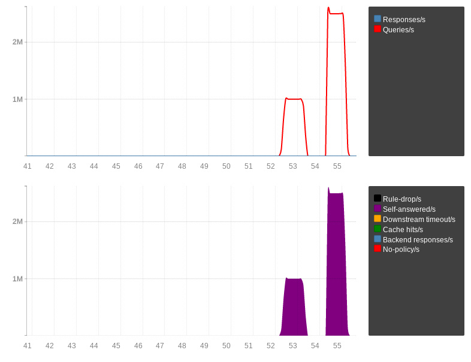
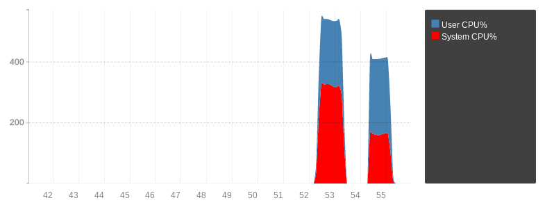

``AF_XDP`` / ``XSK``
====================

Since 1.9.0, :program:`dnsdist` can use `AF_XDP <https://www.kernel.org/doc/html/v4.18/networking/af_xdp.html>`_ for high performance UDP packet processing recent Linux kernels (4.18+). It requires :program:`dnsdist` to have the ``CAP_NET_ADMIN``, ``CAP_SYS_ADMIN`` and ``CAP_NET_RAW`` capabilities at startup, and to have been compiled with the ``--with-xsk`` configure option.

.. note::
   To retain the required capabilities it is necessary to call :func:`addCapabilitiesToRetain` during startup, as :program:`dnsdist` drops capabilities after startup.

.. note::
   ``AppArmor`` users might need to update their policy to allow :program:`dnsdist` to keep the capabilities. Adding ``capability sys_admin,`` (for ``CAP_SYS_ADMIN``) and ``capability net_admin,`` (for ``CAP_NET_ADMIN``) lines to the policy file is usually enough.

.. warning::
  DNSdist's ``AF_XDP`` implementation comes with several limitations:

  - Asymmetrical network setups where the DNS query and its response do not go through the same network device are not supported
  - Ethernet packets larger than 2048 bytes are not supported
  - IP and UDP-level checksums are not verified on incoming DNS messages
  - IP options in incoming packets are not supported

The way ``AF_XDP`` works is that :program:`dnsdist` allocates a number of frames in a memory area called a ``UMEM``, which is accessible both by the program, in userspace, and by the kernel. Using in-memory ring buffers, the receive (``RX``), transmit (``TX``), completion (``cq``) and fill (``fq``) rings, the kernel can very efficiently pass raw incoming packets to :program:`dnsdist`, which can in return pass raw outgoing packets to the kernel.
In addition to these, an ``eBPF`` ``XDP`` program needs to be loaded to decide which packets to distribute via the ``AF_XDP`` socket (and to which, as there are usually more than one). This program uses a ``BPF`` map of type ``XSKMAP`` (located at ``/sys/fs/bpf/dnsdist/xskmap`` by default) that is populated by :program:`dnsdist` at startup to locate the ``AF_XDP`` socket to use. :program:`dnsdist` also sets up two additional ``BPF`` maps (located at ``/sys/fs/bpf/dnsdist/xsk-destinations-v4`` and ``/sys/fs/bpf/dnsdist/xsk-destinations-v6``) to let the ``XDP`` program know which IP destinations are to be routed to the ``AF_XDP`` sockets and which are to be passed to the regular network stack (health-checks queries and responses, for example). A ready-to-use `XDP program <https://github.com/PowerDNS/pdns/blob/master/contrib/xdp.py>`_ can be found in the ``contrib`` directory of the PowerDNS Git repository::

  $ python xdp.py --xsk --interface eth0

Then :program:`dnsdist` needs to be configured to use ``AF_XDP``, first by creating a :class:`XskSocket` object that are tied to a specific queue of a specific network interface:

.. code-block:: lua

  xsk = newXsk({ifName="enp1s0", NIC_queue_id=0, frameNums=65536, xskMapPath="/sys/fs/bpf/dnsdist/xskmap"})

This ties the new object to the first receive queue on ``enp1s0``, allocating 65536 frames and populating the map located at ``/sys/fs/bpf/dnsdist/xskmap``.

Then we can tell :program:`dnsdist` to listen for ``AF_XDP`` packets to ``192.0.2.1:53``, in addition to packets coming via the regular network stack:

.. code-block:: lua

  addLocal("192.0.2.1:53", {xskSocket=xsk})

In practice most high-speed (>= 10 Gbps) network interfaces support multiple queues to offer better performance, so we need to allocate one :class:`XskSocket` per queue. We can retrieve the number of queues for a given interface via::

  $ sudo ethtool -l enp1s0
  Channel parameters for enp1s0:
  Pre-set maximums:
  RX:		n/a
  TX:		n/a
  Other:		1
  Combined:	8
  Current hardware settings:
  RX:		n/a
  TX:		n/a
  Other:		1
  Combined:	8

The ``Combined`` lines tell us that the interface supports 8 queues, so we can do something like this:

.. code-block:: lua

  for i=1,8 do
    xsk = newXsk({ifName="enp1s0", NIC_queue_id=i-1, frameNums=65536, xskMapPath="/sys/fs/bpf/dnsdist/xskmap"})
    addLocal("192.0.2.1:53", {xskSocket=xsk, reusePort=true})
  end

This will start one router thread per :class:`XskSocket` object, plus one worker thread per :func:`addLocal` using that :class:`XskSocket` object.

We can instructs :program:`dnsdist` to use ``AF_XDP`` to send and receive UDP packets to a backend in addition to packets from clients:

.. code-block:: lua

  local sockets = {}
  for i=1,8 do
    xsk = newXsk({ifName="enp1s0", NIC_queue_id=i-1, frameNums=65536, xskMapPath="/sys/fs/bpf/dnsdist/xskmap"})
    table.insert(sockets, xsk)
    addLocal("192.0.2.1:53", {xskSocket=xsk, reusePort=true})
  end

  newServer("192.0.2.2:53", {xskSocket=sockets})

This will start one router thread per :class:`XskSocket` object, plus one worker thread per :func:`addLocal`/:func:`newServer` using that :class:`XskSocket` object.

We are not passing the MAC address of the backend (or the gateway to reach it) directly, so :program:`dnsdist` will try to fetch it from the system MAC address cache. This may not work, in which case we might need to pass explicitly:

.. code-block:: lua

  newServer("192.0.2.2:53", {xskSocket=sockets, MACAddr='00:11:22:33:44:55'})

Performance
-----------

Using `kxdpgun <https://www.knot-dns.cz/docs/latest/html/man_kxdpgun.html>`_, we can compare the performance of :program:`dnsdist` using the regular network stack and ``AF_XDP``.

This test was realized using two Intel E3-1270 with 4 cores (8 threads) running at 3.8 Ghz, using Intel 82599 10 Gbps network cards. On both the injector running ``kxdpgun`` and the box running :program:`dnsdist` there was no firewall, the governor was set to ``performance``, the UDP buffers were raised to ``16777216`` and the receive queue hash policy set to use the IP addresses and ports (see :doc:`tuning`).

:program:`dnsdist` was configured to immediately respond to incoming queries with ``REFUSED``:

.. code-block:: lua

  addAction(AllRule(), RCodeAction(DNSRCode.REFUSED))

On the injector box we executed::

  $ sudo kxdpgun -Q 2500000 -p 53 -i random_1M 192.0.2.1 -t 60
  using interface enp1s0, XDP threads 8, UDP, native mode
  [...]

We first ran without ``AF_XDP``:

.. code-block:: lua

  for i=1,8 do
    addLocal("192.0.2.1:53", {reusePort=true})
  end

then with:

.. code-block:: lua

  for i=1,8 do
    xsk = newXsk({ifName="enp1s0", NIC_queue_id=i-1, frameNums=65536, xskMapPath="/sys/fs/bpf/dnsdist/xskmap"})
    addLocal("192.0.2.1:53", {xskSocket=xsk, reusePort=true})
  end

The first run handled roughly 1 million QPS, the second run 2.5 millions, with the CPU usage being much lower in the ``AF_XDP`` case.

Running under systemd
---------------------

:program:`dnsdist` needs quite a few more additional permissions to use ``AF_XDP``:

- to access the ``BPF`` maps directory, it needs to be able to go into the ``/sys/fs/bpf`` directory: one option is to ``chmod o+x /sys/fs/bpf``, a safer one is to restrict that to the ``dnsdist`` user instead via ``chgrp dnsdist /sys/fs/bpf && chmod g+x /sys/fs/bpf``
- to read the ``BPF`` maps themselves, they need to be readable by the ``dnsdist`` user: ``chown -R dnsdist:dnsdist /sys/fs/bpf/dnsdist/``
- to create ``AF_XDP`` sockets: add ``AF_XDP`` to ``RestrictAddressFamilies`` in the systemd unit file
- to load a BPF program: add ``CAP_SYS_ADMIN`` to ``CapabilityBoundingSet`` and ``AmbientCapabilities`` in the systemd unit file
- to create raw network sockets: add ``CAP_NET_RAW`` to ``CapabilityBoundingSet`` and ``AmbientCapabilities`` in the systemd unit file
- and finally to lock enough memory: ensure that ``LimitMEMLOCK=infinity`` is set in the systemd unit file
