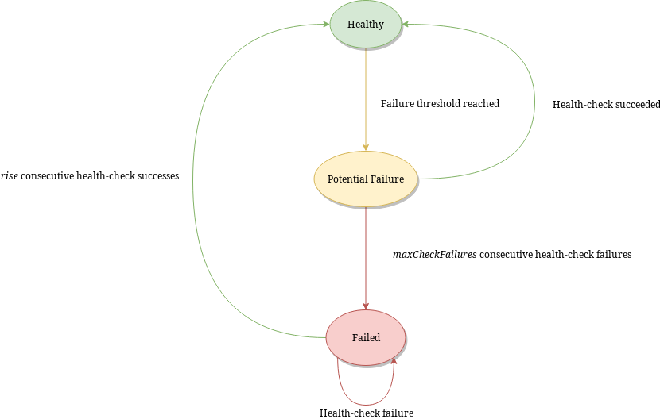

Configuring Downstream Servers
==============================

As dnsdist is a loadbalancer and does not do any DNS resolving or serving by itself, it needs downstream servers.
To add downstream servers, either include them on the command line::

    dnsdist -l 130.161.252.29 -a 130.161.0.0/16 8.8.8.8 208.67.222.222 2620:0:ccc::2 2620:0:ccd::2

Or add them to the configuration file:

.. code-block:: lua

    setLocal("130.161.252.29:53")
    setACL("130.161.0.0/16")
    newServer("8.8.8.8")
    newServer("208.67.222.222")
    newServer("2620:0:ccc::2")
    newServer("2620:0:0ccd::2")

These two equivalent configurations give you sane load balancing using a very sensible distribution policy.
Many users will simply be done with this configuration.
It works as well for authoritative as for recursive servers.

.. _Healthcheck:

Healthcheck
-----------

dnsdist uses health-check queries, sent once every second, to determine the availability of a backend server. Since 1.8.0, it also supports a ``lazy`` health-checking mode which only sends active health-check queries after a configurable threshold of regular queries have failed, see below.

By default, an ``A`` query for the "a.root-servers.net." name is sent. A different query type, class and target can be specified by passing, respectively, the ``checkType``, ``checkClass`` and ``checkName`` parameters to :func:`newServer`. The interval between two health-check queries can be set via the ``checkInterval`` interval parameter, and the amount of time for a response to be received via the ``checkTimeout`` one.

Since the 1.3.0 release, the ``checkFunction`` option is also supported, taking a ``Lua`` function as parameter. This function receives a DNSName, two integers and a ``DNSHeader`` object (:ref:`DNSHeader`)
representing the QName, QType and QClass of the health check query as well as the DNS header, as they are defined before the function was called. The function must return a DNSName and two integers
representing the new QName, QType and QClass, and can directly modify the ``DNSHeader`` object.

The following example sets the CD flag to true and change the QName to "powerdns.com." and the QType to AAAA while keeping the initial QClass.

.. code-block:: lua

    function myHealthCheck(qname, qtype, qclass, dh)
      dh:setCD(true)

      return newDNSName("powerdns.com."), DNSQType.AAAA, qclass
    end

    newServer({address="2620:0:0ccd::2", checkFunction=myHealthCheck})

The default behavior is to consider any valid response with an ``RCODE`` different from ``ServFail`` as valid.
If the ``mustResolve`` parameter of :func:`newServer` is set to ``true``, a response will only be considered valid if its ``RCODE`` differs from ``NXDomain``, ``ServFail`` and ``Refused``.

The number of health check failures before a server is considered down is configurable via the ``maxCheckFailures`` parameter, defaulting to 1. In the same way, the number of consecutive successful health checks needed for a server to be considered available can be set via the ``rise`` parameter, defaulting to 1.

The ``CD`` flag can be set on the query by setting ``setCD`` to true.
e.g.::

  newServer({address="192.0.2.1", checkType="AAAA", checkClass=DNSClass.CHAOS, checkName="a.root-servers.net.", mustResolve=true})

In ``yaml``:

.. code-block:: yaml

  backends:
    - address: "192.0.2.1"
      protocol: "Do53"
      health_checks:
        qname: "a.root-servers.net."
        qtype: "AAAA"
        qclass: "CHAOS"
        must_resolve: true

You can turn on logging of health check errors using the :func:`setVerboseHealthChecks` function.

Lazy health-checking
~~~~~~~~~~~~~~~~~~~~

In some setups, especially on low-end devices, it might not make sense to actively send queries to the backend at a regular interval. Using the feedback from the results of regular queries can instead be used to infer if a backend might not be working properly.

Since 1.8.0, dnsdist implements a ``lazy`` mode that can be set via the ``healthCheckMode`` option on :func:`newServer`. In this mode, dnsdist will only send active health-check queries after seeing a configurable amount of regular queries failing. It will then place the backend in a ``PotentialFailure`` state, from the initial ``Healthy`` one, and send health-check queries every ``checkInterval`` seconds. If ``maxCheckFailures`` of these fail, the backend is then moved to a ``Failed`` state and marked as ``down``, and active health-check queries are sent every ``lazyHealthCheckFailedInterval`` seconds. After ``rise`` successful, consecutive queries, the backend will be moved back to the ``Healthy`` state and marked as ``up`` again, and health-check queries will stop.

The threshold of failed regular queries is configured via ``lazyHealthCheckThreshold``, indicating of percentage of regular queries that should have resulted in a failure over the last recent queries. Only the results of the last ``lazyHealthCheckSampleSize`` queries will be considered, as the results are kept in a in-memory circular buffer. The results of at least ``lazyHealthCheckMinSampleCount`` queries should be present for the threshold to be considered meaningful, to avoid an issue with a too small sample.

By default both queries that resulted in a timeout and those that received a ``ServFail`` answer are considered failures, but it is possible to set ``lazyHealthCheckMode`` to ``TimeoutOnly`` so that only timeouts are considered failures.

So for example, if we set ``healthCheckMode`` to ``lazy``, ``lazyHealthCheckSampleSize`` to 100, ``lazyHealthCheckMinSampleCount`` to 10, ``lazyHealthCheckThreshold`` to 30, ``maxCheckFailures`` to 2 and ``rise`` to 2:

- nothing will happen until at least 10 queries have been received
- only the results of the last 100 queries will be considered
- if at least 30 of these last 100 have failed, the threshold will be reached and active health-check queries will be sent every ``checkInterval`` seconds
- if the health-check query is successful, the backend will stay ``up`` and no more query will be sent
- but if instead two consecutive queries fail, the backend will be marked as ``down`` and health-check queries will be sent every ``lazyHealthCheckFailedInterval`` seconds
- it will take two consecutive, successful health-checks for the backend to go back to ``Healthy`` and be marked `up` again

.. code-block:: lua

    newServer({address="192.0.2.1", healthCheckMode='lazy', checkInterval=1, lazyHealthCheckFailedInterval=30, rise=2, maxCheckFailures=3, lazyHealthCheckThreshold=30, lazyHealthCheckSampleSize=100,  lazyHealthCheckMinSampleCount=10, lazyHealthCheckMode='TimeoutOnly'})

.. code-block:: yaml

  backends:
    - address: "192.0.2.1"
      protocol: "Do53"
      health_checks:
        mode: "lazy"
        rise: 2
        max_failures: 3
        check_interval: 1
        lazy:
          mode: "TimeoutOnly"
          interval: 30
          threshold: 30
          sample_size: 100
          min_sample_count: 10

The 'lazy' mode also supports using an exponential back-off time between health-check queries, once a backend has been moved to the 'down' state. This can be enabled by setting the ``lazyHealthCheckUseExponentialBackOff`` parameter to 'true'. Once the backend has been marked as 'down', the first query will be sent after ``lazyHealthCheckFailedInterval`` seconds, the second one after 2 times ``lazyHealthCheckFailedInterval`` seconds, the third after 4 times ``lazyHealthCheckFailedInterval`` seconds, and so on and so forth, until ``lazyHealthCheckMaxBackOff`` has been reached. Then probes will be sent every ``lazyHealthCheckMaxBackOff`` seconds (default is 3600 so one hour) until the backend comes 'up' again.

Source address selection
------------------------

In multi-homed setups, it can be useful to be able to select the source address or the outgoing
interface used by dnsdist to contact a downstream server. This can be done by using the `source` parameter::

  newServer({address="192.0.2.1", source="192.0.2.127"})
  newServer({address="192.0.2.1", source="eth1"})
  newServer({address="192.0.2.1", source="192.0.2.127@eth1"})

.. code-block:: yaml

  backends:
    - address: "192.0.2.1"
      protocol: "Do53"
      source: "192.0.2.127@eth1"

The supported values for source are:

- an IPv4 or IPv6 address, which must exist on the system
- an interface name
- an IPv4 or IPv6 address followed by '@' then an interface name

Please note that specifying the interface name is only supported on system having `IP_PKTINFO`.

Securing the channel
--------------------

Securing the path to the backend
--------------------------------

As explained briefly in the quickstart guide, dnsdist has always been designed as a load-balancer placed in
front of authoritative or recursive servers, assuming that the network path between dnsdist and these servers
is trusted. This is particularly important because for performance reasons it uses a single connected socket
for UDP exchanges by default, and easy to predict DNS query IDs, which makes it easy for an attacker to poison
responses.

If dnsdist is instead intended to be deployed in such a way that the path to its backend is not secure, the
UDP protocol should not be used, and 'TCP-only', DNS over TLS and DNS over HTTPS protocols used instead, as
supported since 1.7.0.

Using these protocols leads to all queries, regardless of whether they were initially received by dnsdist over
UDP, TCP, DoT or DoH, being forwarded over a TCP socket, a secure DNS over TLS channel or a secure DNS over HTTPS
channel.

The TCP-only mode for a backend can be enabled by using the ``tcpOnly`` parameter of the :func:`newServer` command.

The DNS over TLS mode via the ``tls`` parameter of the :func:`newServer` command. Additional parameters control the
validation of the certificate presented by the backend (``caStore``, ``validateCertificates``), the actual TLS ciphers
used (``ciphers``, ``ciphersTLS13``) and the SNI value sent (``subjectName``).

The DNS over HTTPS mode in the same way than DNS over TLS but with the additional ``dohPath`` keyword indicating that
DNS over HTTPS should be used instead of DNS over TLS.

If it is absolutely necessary to support UDP exchanges over an untrusted network, a few options have been introduced in
1.8.0 to make spoofing attempts harder:

- :func:`setRandomizedIdsOverUDP` will randomize the IDs in outgoing queries, at a small performance cost. :func:`setMaxUDPOutstanding`
  should be set at its highest possible value (default since 1.4.0) to make that setting fully efficient.

- :func:`setRandomizedOutgoingSockets` can be used to randomize the outgoing socket used when forwarding a query to a backend.
  This requires configuring the backend to use more than one outgoing socket via the ``sockets`` parameter of :func:`newServer`
  to be of any use.
