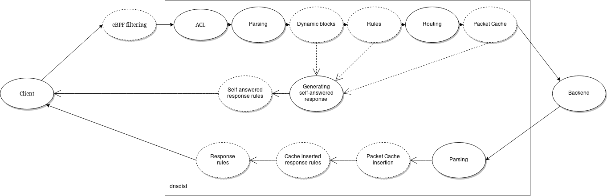

Packet Policies
===============

:program:`dnsdist` works in essence like any other loadbalancer:

It receives packets on one or several addresses it listens on, and determines whether it will process this packet based on the :doc:`advanced/acl`. Should the packet be processed, :program:`dnsdist` attempts to match any of the configured rules in order and when one matches, the associated action is performed.

These rule and action combinations are considered policies. The complete list of selectors (rules) can be found in :doc:`reference/selectors` (:doc:`reference/yaml-selectors`), and the list of actions in :doc:`reference/actions` (:doc:`reference/yaml-actions` and :doc:`reference/yaml-response-actions`).

Packet Actions
--------------

Each packet can be:

- Dropped
- Turned into an answer directly
- Forwarded to a downstream server
- Modified and forwarded to a downstream and be modified back
- Be delayed

This decision can be taken at different times during the forwarding process.
All packets not handled by an explicit action are forwarded to a downstream server in the default pool.

Examples
~~~~~~~~

Rules for traffic exceeding QPS limits
^^^^^^^^^^^^^^^^^^^^^^^^^^^^^^^^^^^^^^

Traffic that exceeds a QPS limit, in total or per IP (subnet) can be matched by a rule.

For example::

  addAction(MaxQPSIPRule(5, 32, 48), DelayAction(100))

This measures traffic per IPv4 address and per /48 of IPv6, and if traffic for such an address (range) exceeds 5 qps, it gets delayed by 100ms. (Please note: :func:`DelayAction` can only delay UDP traffic).

As another example::

  addAction(MaxQPSIPRule(5), SetNoRecurseAction())

This strips the Recursion Desired (RD) bit from any traffic per IPv4 or IPv6 /64 that exceeds 5 qps.
This means any those traffic bins is allowed to make a recursor do 'work' for only 5 qps.

If this is not enough, try::

  addAction(MaxQPSIPRule(5), DropAction())

or::

  addAction(AndRule{MaxQPSIPRule(5), TCPRule(false)}, TCAction())

This will respectively drop traffic exceeding that 5 QPS limit per IP or range, or return it with TC=1, forcing clients to fall back to TCP.

In that last one, note the use of :func:`TCPRule`.
Without it, clients would get TC=1 even if they correctly fell back to TCP.

To turn this per IP or range limit into a global limit, use ``NotRule(MaxQPSRule(5000))`` instead of :func:`MaxQPSIPRule`.

Regular Expressions
^^^^^^^^^^^^^^^^^^^

:func:`RegexRule` matches a regular expression on the query name, and it works like this::

  addAction(RegexRule("[0-9]{5,}"), DelayAction(750)) -- milliseconds
  addAction(RegexRule("[0-9]{4,}\\.example$"), DropAction())

This delays any query for a domain name with 5 or more consecutive digits in it.
The second rule drops anything with more than 4 consecutive digits within a .example domain.

Note that the query name is presented without a trailing dot to the regex.
The regex is applied case-insensitively.

Alternatively, if compiled in, :func:`RE2Rule` provides similar functionality, but against libre2.

Note that to check if a name is in a list of domains, :func:`QNameSuffixRule` is preferred over complex regular expressions or multiple instances of :func:`RegexRule`.

Managing Rules
--------------

Active Rules can be shown with :func:`showRules` and removed with :func:`rmRule`::

  > addAction("h4xorbooter.xyz.", QPSAction(10))
  > addAction({"130.161.0.0/16", "145.14.0.0/16"} , QPSAction(20))
  > addAction({"nl.", "be."}, QPSAction(1))
  > showRules()
  #     Matches Rule                                               Action
  0           0 h4xorbooter.xyz.                                   qps limit to 10
  1           0 130.161.0.0/16, 145.14.0.0/16                      qps limit to 20
  2           0 nl., be.                                           qps limit to 1

See :doc:`reference/rules-management` for more information.
